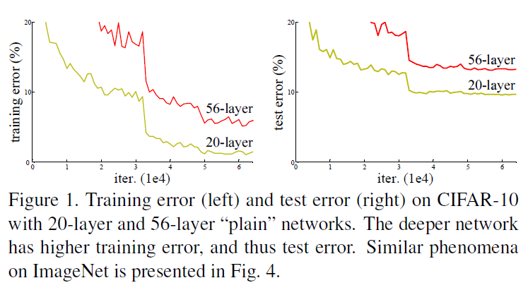

# DEEP RESIDUAL LEARNING FOR IMAGE RECOGNITION
[논문 링크](https://www.cv-foundation.org/openaccess/content_cvpr_2016/papers/He_Deep_Residual_Learning_CVPR_2016_paper.pdf)  
Author: Kaiming He, Xiangyu Zhang, Shaoqing Ren, Jian Sun

* 공부 중이므로 정확하지 않을 수 있습니다.
## Abstract
They present a residual learning framework to ease the training of networks that deeper than those used previously.  
더 깊은 (deeper) 네트워크의 훈련을 쉽게 하기 위해 residual을 제시  
깊이는 8배 더 깊지만, 복잡도는 더 낮음!

## Introduction
네트워크의 depth가 깊어지면 쉽게 성능 향상을 할 수 있을 것 같지만, 2가지 문제를 유발하게 된다.
1. vanishing/exploding gradient issue
2. training error 증가 (depth of network에 따른)

이러한 degradation 문제를 해결하기 위해 제안한 방법이 residual learning.
  
기존에는 `x -> H(x)` 였다면, `F(x) = H(x) - x`로 출력과 입력간의 차에 대해 학습을 시켜 degradation 문제를 해결할 수 있다고 제시.  
`H(x) = F(x) + x`
입력 x값을 출력값에 더하는 identity mapping을 수행하며, (shortcut connections) 이렇게 함으로써 추가적인 파라미터가 필요하지 않고, 계산적 복잡도가 증가하지 않게 된다.
- 차원이 같은 경우
`y = F(X) + x`
- 차원이 다른 경우
` y = F(x) + Ws*x`
  
