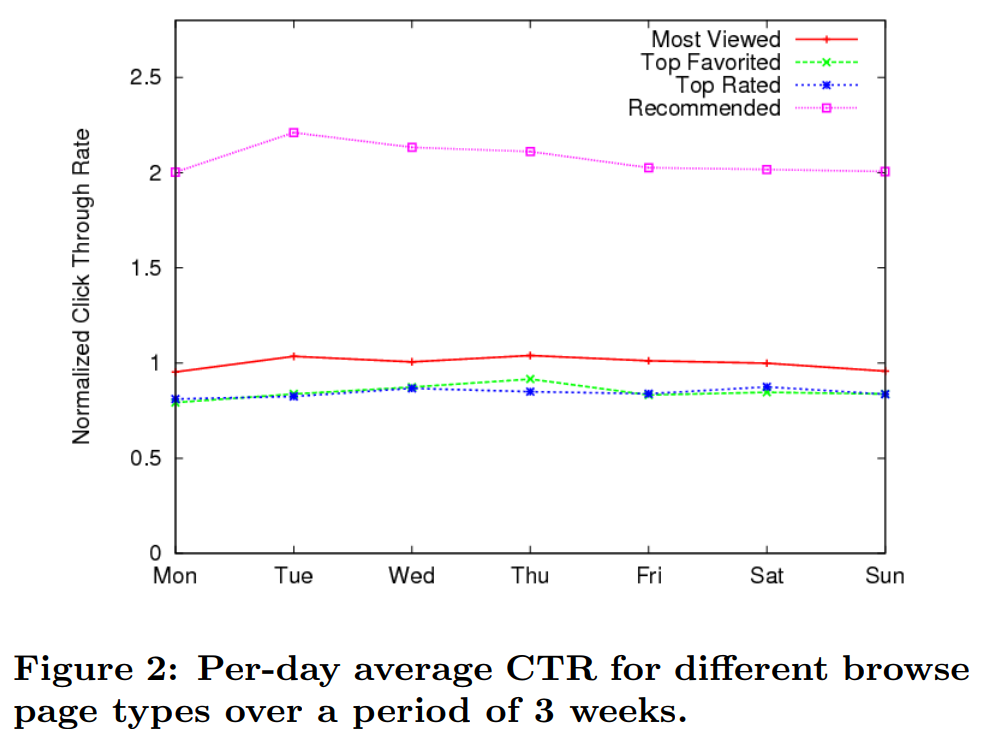

# The YouTube Video Recommendation System

## 이 논문에서 다루는 내용
사람들이 유튜브에서 활동하는 행위에 기반하여 개인화된 비디오셋을 추천하는 방법에 대해서 다루어보고, 해당 알고리즘을 테스트하고 튜닝하는 방법에 대해서도 이야기한다.

## 유튜브 추천 시스템의 목표
사용자가 유튜브를 찾게 되는 이유
1. Direct Navigation: 다른 곳에서 찾은 영상을 유튜브에서 보게 되는 경우. (링크와 같은 형태)  
2. Search: 구글이나 여타 웹사이트들처럼 무언가를 찾기 위해 접속하게 되는 경우.  
3. Unarticulated want: 의도 없음. 시간을 때우는 경우

이 논문의 추천 시스템의 목표는, 의도 없이 들어오는 사용자들에게 개인화 영상을 추천하여 유튜브에 계속 머무르도록 하는 것.

하지만 이를 유튜브에서는 개인화된 추천 알고리즘을 구현하기에 어려운 점이 몇 가지 존재한다.  
1. 영상과 사용자의 수가 매우 많고, 대부분의 영상이 10분 이내의 짧은 영상들로 이루어져있다.
    따라서, 사용자와 영상의 상호작용에 해당하는 시간이 매우 짧다.  
2. 유튜브의 많은 영상들은 매우 짧은 사이클을 갖고 있으며, 순간적으로 인기를 타는 비디오들이 많아 추천을 매우 짧은 주기로 갱신해야한다.  

## 시스템 디자인
시스템이 원하는 것은, 사용자들에게 추천되는 영상 목록들이 주로 **최근**의 것들이며 **신선하고, 새로운** 영상들이기를 원한다.  
또한 사용자들이 추천받았을 때에 **이 영상이 나에게 왜 추천되었는가**를 알 수 있는 영상들로 추천되기를 원한다.

### 주어지는 데이터
1. Explicit data: 동영상의 제목, 설명 등과 같은 metadata  
2. Implicit data: 사용자가 비디오를 보고 상호작용한 결과로 생성되는 데이터(ex. 사용자가 해당 비디오를 오랫동안 시청했다 등)  

### 연관된 비디오셋 생성
Candidate generation  
사용자가 관심을 보였던 비디오들과 연관되어있지 않을 것 같은 비디오를 쳐내서 랭킹 후보셋의 크기를 줄이는 과정. 방법으로는 **association rule mining**을 사용함.
    * Seed video set 생성
       유저가 반응을 보였던 비디오들을 모아서 seed video set `v`를 만든다.
    * seed video set의 각 비디오와 관련된 related videos 생성
        보통 24시간 내에 `v`에 포함된 각 비디오 `vi`와 같은 세션에서 시청되었던 다른 비디오 `vj`를 뽑아서, `vi`와의 relatedness score `r(vi,vj)`가 가장 높은 상위 `N`개의 비디오 `vj`를 비디오 `v_i`의 Related Video `R_i`로 정의한다.  
        related score `r`은 `c_{i,j}/f(v_i,v_j)` 로 계산한다. `c`는 하나의 유저 세션 내에서 `vi, vj`가 같이 시청된 횟수이며, `f(vi,vj)`는 seed video `vi`와 candidate video `vj`의 global popularity 를 고려해서 `c_i,j`를 정규화하는 역할을 한다.  
        
## 후보셋 생성
개인화된 추천은 사용자의 유튜브에서의 활동과 related videos association rules를 결합하여 계산한다.  
사용자의 유튜브에서의 활동에는 좋아요, 플레이리스트에 추가 등등이 포함된다. 우리는 이런 비디오셋들을 모두 모아 *seed set*이라고 부른다.  
주어진 seed set S를 위한 후보셋을 얻기 위해서, 연관된 비디오를 나타내는 그래프의 엣지를 확장시킬 필요가 있다.  

seed set의 각 비디오 `vi`에 대해서 그의 연관된 비디오들인 `Ri`를 고려하는데, 이를 우리는 `C1`이라고 나타낸다.  
즉, `C1(S) = union_{vi in S}(Ri)` 이다.  
대부분 `C1`을 계산하면 흥미로운 추천을 위한 다양한 후보 셋을 제공하기에 충분하지만, 모든 연관된 비디오들에 대해 이 작업을 수행하기 때문에 유사한 영상들만이 추천될 수 있습니다.  
EX. 아이들 영상을 보면 아이들 영상만 계속 추천됨.  

따라서, 추천의 범위를 넓히기 위해 관련 동영상 그래프에 한정된 transitive closure의 limited를 취함으로써 후보 셋을 확대합니다.  
즉, `Cn`을 seed set의 모든 비디오에서 거리 n 내에 도달할 수 있는 비디오셋으로 정의합니다.  
`Cn(S) = union_{vi in Cn-1}(Ri) where C0 = S`  
따라서 `C_final`은 `Ci`의 합집합에서 `S`를 차집합한 결과(유저가 이미 봤던 비디오셋 `S`를 최종 후보셋에서 제외)로 정의됩니다.

## 순위 매기기
위와 같이 후보셋을 뽑아내고 난 뒤, 일반 추천 시스템에서처럼 후보셋의 비디오들에 대해서 순위를 매기는 알고리즘을 적용한다.  
1. Video Quality: 유저에 상관없이 비디오의 절대적인 품질을 측정, 비디오 총 시청 횟수나 rating, 공유 횟수 등  
2. User Specificity: 유저 활동 로그를 기반으로 개인화된 추천 점수. seed set `S`를 사용해서 추출  
3. Diversification: 같은 채널이나 비슷한 비디오가 너무 많이 추천되지 않도록 조정하는 것  

--> 1과 2의 선형 결합으로 비디오의 랭킹을 매겨 추천 리스트를 생성한 뒤에, 생성된 리스트를 post-processing해서 diversity의 일부를 조정하는 방식  

## 엔지니어링
* 추천셋 업데이트 방식  
    1. Batch 방식: 유저별 추천리스트를 미리 계산한 뒤, 실제 서비스 시에는 유저별로 저장된 리스트를 바로 불러와서 제공  
    2. 잦은 업데이트  
* 유저별 로그 저장 방식  
    유저단위로 db에 저장  
* 유저별 추천셋 저장 방식   
    Bigtable을 사용하여 Read-only 스타일로 저장 
    
## 성능 평가
  
* CTR (Click Through Rate): 사용자가 추천된 컨텐츠를 클릭한 비율  
위 Fig에서는 3주간 측정한 평균 CTR을 그래프로 나타내었습니다. 거의 2배 정도의 효과를 불러일으킨 것을 확인할 수 있습니다.. wow  

CTR 이외에도 평가 기준에는 다양한 것들이 존재합니다.  
* Long CTR: 사용자가 추천된 컨텐츠를 장시간 시청한 비율  
* 개별 유저 세션 길이  
* 유저가 접속한 뒤 첫번째로 오래 시청하기 까지의 소요 시간  
* 추천 coverage: 개인하된 추천셋을 실제로 받아보게 되는 유저 수  

## 결론
Scalable 2-step Ranking: Candidate Generation -> Ranking
