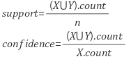

# Question Keyword 4 👻
오늘의 Question Keyword는 `Collaborative Filtering`, `Association Rule Mining`, `Multi-Armed Bandits` 입니다.  
- - -
## Collaborative Filtering (협업 필터링)
추천 시스템에는 두 가지 유형이 존재합니다.  
* 콘텐츠 기반 필터링  
    콘텐츠 기반 필터링은 사용자가 특정 아이템을 선호할 때, 그 아이템과 비슷한 콘텐츠를 가진 다른 아이템을 추천해주는 방법.  
* 협업 필터링  
    협업 필터링은 사용자가 아이템에 매긴 평점 정보나, 구매 이력과 같은 User Behavior을 기반으로 추천해주는 방법.
    - 최근접 이웃 필터링
    - 잠재요인 필터링 (Latent Factor)
    
    협업 필터링은 사용자-아이템 평점 매트릭스를 기반으로 아직 평가하지 않은 아이템을 예측 평가하는 것을 목적으로 한다.
    
### 최근접 이웃 필터링
- USER-USER (사용자 기반)
    당신과 비슷한 고객이 다음 상품도 구매했습니다.
- ITEM-ITEM (아이템 기반)
    이 상품을 선택한 다른 고객들은 다음 상품도 구매했습니다.  

* 사용자 기반으로 추천한다면?

| |다크나이트|프로메테우스|스타워즈|
|------|---|---|---|
|사용자1|4|5|5|
|사용자2|5|4| |
|사용자3|3|1|3|

--> 사용자 2에게 다음 영화로 `스타워즈` 를 추천한다.   
WHY? 사용자 1과 비슷한 취향을 가졌다고 판단.  

* 아이템 기반으로 추천한다면?   
 
| |사용자1|사용자2|사용자3|
|------|---|---|---|
|다크나이트|4|5|5|
|프로메테우스|5|4|5|
|스타워즈|3|2|3|

--> 다크나이트와 프로메테우스의 유사도가 높다고 판단한다.  
WHY? 사용자들의 평점 결과가 비슷하므로. 
    
### 잠재 요인 필터링
사용자-아이템 평점 매트리스속에 숨은 잠재요인을 추출해 예측하는 방법  
USER - ITEM ≅ USER - LATENT * Transpose(ITEM - LATENT)  

- - -
## Association Rule Mining
Association Rule은 데이터 간의 연관 법칙을 찾는 방법이다.  
가게에서 물건을 사는 것으로 예를 들어보자면, 소비자들이 상품을 구매하는 이력을 이용하여 상품 간의 연관관계를 만들고, 관계가 있는 상품, 관계 없는 상품 등을 구할 수 있다.  
즉, 연관 마이닝은 관계가 있는 아이템을 찾는 것을 목표로 한다.  

연관 관계 마이닝에서 연관 관계를 설정하기 위해 `Support`와 `Confidence`라는 두가지 요소가 사용되게 된다.  
`Support`는 관계를 설정하기 위한 상품이 동시에 발생될 확률을 의미하며,  
`Confidence`는 특정 상품이 선택된 뒤, 다른 상품이 선택될 확률을 의미한다.  
    
`Support`는 X,Y라는 아이템이 얼마나 자주 발생되었는지를 측정해준다.
`Confidence`는 조건부 확률로 Y가 선택되었을 때, X가 선택되었을 확률을 의미하며 두 아이템 간의 순차적인 연관성을 설명한다. (예측 가능성)
- - -

## Multi-Armed Bandits
"슬롯 머신에 어떻게 투자하면 최적의 수익을 얻을 수 있을까?"  

멀티 암드 밴딧은 카지노에서 슬롯 머신 투자를 최적화하기 위해 만들어진 알고리즘이다.  
N개의 슬롯 머신이 존재하고, 각각의 슬롯 머신은 수익률이 다르다. 우리는 여기서 어느 슬롯머신에 돈을 걸고, 어느 슬롯 머신의 암(손잡이)을 내려야 돈을 제일 많이 벌 수 있을까?  
여기서 슬롯 머신이 BANDIT 이고, 슬롯 머신의 손잡이가 ARM 이다.  

### 탐색과 활용
오늘 카지노를 방문해, 3가지 슬롯 머신 기계를 동시에 플레이한다. 우리는 돈을 벌기 위한 전략을 수립해야한다고 가정하자.  

1. Greedy  
    3가지 슬롯 머신을 모두 한번씩 플레이한 뒤, 돈을 가장 많이 딴 슬롯머신에 모두 투자한다.  
    즉, (이 슬롯 머신으로 얻은 보상의 합 / 전체 슬롯 머신 시도 횟수)의 기대 보상을 최대로 만들어주는 슬롯 머신을 선택하는 방법이다.  
2. Epsilon - Greedy  
    50% 확률로는 greedy 알고리즘으로 경험상 성능이 좋았던 슬롯머신을 선택하고, 나머지 50%의 확률로는 슬롯 머신의 성능과 관계없이 랜덤으로 고른다.  
    (나름 심플하면서 강력한 방법이다.)  
3. UCB (Upper-Confidence-Bound)  
    좋은 수익률을 보이며 최적의 선택이 될 가능성이 있는 슬롯 머신을 선택한다.  
    즉, 해당 슬롯머신이 최적의 슬롯머신이 될 가능성이라는 텀을 수식에 추가하여 기대 보상을 최대로 만들어주는 슬롯 머신을 선택한다.  
    이 가능성 텀은 모든 슬롯머신을 선택한 횟수의 합에 로그를 취한 값을 해당 슬롯머신을 선택한 횟수로 나누어 루트를 취해 계산한다. 
    
이 외에도 softmax, moving-average 등 여러가지 방법이 존재한다.  
자세한 내용은 [MAB](https://soobarkbar.tistory.com/135)를 참고!!!!