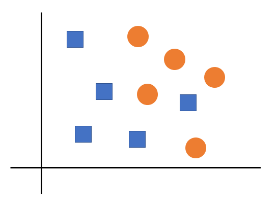
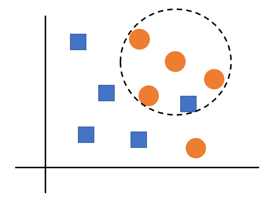
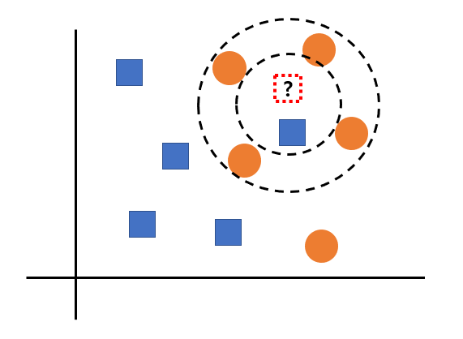

# Question Keyword 5 🎅
오늘의 Question Keyword는 `A/B TEST`, `negative sampling`, `k-최근접 이웃 알고리즘` 입니다.  
- - -

# A/B test
**A/B 테스트**는 실험군, 대조군으로 나눠 실험군에는 대조군과 한가지만 다른 설정을 하여 나머지 조건은 동일하게 설정한 뒤, 50:50으로 배치하여 결과를 확인하는 방법입니다. 

## A/B 테스트를 하는 이유
A/B 테스팅을 하는 이유는 상관관계로부터 인과관계 - 정확히 말하면 인과관계일 가능성이 높은 것 - 를 찾아내기 위함입니다. 그래야만 우리가 “원인”에 해당하는 요소에 개입을 하여 “결과”에 해당하는 요소가 우리가 원하는 방향으로 변화되도록 할 수 있습니다. 혹은 이미 “결과”에 변화가 생겼을 때 이 변화의 “원인”이 우리가 했던 그 개입 때문이 맞는지 아닌지 판단할 수 있습니다.  

`물놀이 사고를 줄이는 것`이 우리의 목표라고 가정해봅시다. 이런저런 조사를 해보니 `아이스크림 판매량`과 `물놀이 사고의 빈도` 사이에 높은 양의 상관이 있다는 사실을 찾아냈습니다.아이스크림 판매량이 높아지면 물놀이 사고 빈도도 높아지고, 아이스크림 판매량이 낮아지면 물놀이 사고 빈도도 낮아지는 식인거죠.  

이 상관관계를 아래와 같은 인과관계로 해석하면 물놀이 사고를 줄이기 위해 우리가 해야할 일은 명확합니다. 아이스크림 가격을 올리는 등 다양한 방법을 써서 아이스크림의 판매량을 줄이는 것입니다:
`"아이스크림 판매량" -> "물놀이 사고 빈도"`  
하지만, 모든 상관관계가 인과관계인 것은 아닙니다. 즉, 아이스크림 판매량의 증가는 물놀이 사고 빈도 증가의 원인이 아닙니다. 아마 숨어있는 원인이 있을 것입니다. 예를 들자면,  
`"날씨(비?) -> {"아이스크림 판매량", "물놀이 사고 빈도"}`  
날씨라는 또다른 요인이 아이스크림 판매량과 물놀이 사고에 공통으로 영향을 주는 원인인 것입니다.    
  
A/B 테스트 시 주의 사항은 A/B 테스팅을 통해 찾아낸 결과가 범용성을 가지기 위해서 실험에 참가한 집단이 모집단을 대표할 수 있어야한다는 점입니다. 즉, 임의적 샘플링을 통해 추출해야합니다.  

# Negative Sampling
**Negative Sampling**은, 계산의 효율을 위해 소프트맥스 확률을 구할 때 전체 단어를 대상으로 하지 않고 일부 단어만 뽑아 계산을 하는 방법입니다.  
사용자가 지정한 윈도우 사이즈 내에 등장하지 않는 단어를 5~20개 정도 뽑은 뒤, 정답 단어와 합쳐 전체 단어처럼 소프트맥스 확률을 구하는 것입니다. 즉, 윈도우 사이즈가 5인경우 최대 25개 단어를 대상으로만 softmax 확률을 계산하는 것입니다.   
예를 들자면, (김치, 반찬), (김치, 된장), (김치, 식사)의 조합을 업데이트 하기 위해 김치와 관계없는 폴란드, 핸드폰, 변기 이러한 관계를 update해도 안한 것과 별반 차이가 없다는 것입니다. 김치와 주변 단어가 아닌 단어가 김치와 주변단어인 단어보다 훨씬 더 많으므로, 모두 업데이트할 필요가 없다는 것이죠.  
따라서 수많은 김치와 상관없는 단어들 중 몇가지만 추출하여 학습에 사용하는 방법입니다.  

* negative sample을 뽑는 과정  
전체 corpus 중 문장에 사용되는 비중이 높은 단어를 가중치 주어 선별  

# K-최근접 알고리즘
**최근접 알고리즘(NN)**은 새로운 데이터를 입력 받았을 때, 가장 가까이에 있는 것이 무엇이냐를 중심으로 새로운 데이터의 종류를 정해주는 알고리즘입니다. 
  
그림에서 보다시피, 주변에 가장 가까이에 있는 것이 어떤 도형인지를 중심으로 새로운 데이터의 종류를 정할 수 있습니다.  
  
하지만, 새로운 데이터의 종류를 위해 구분할 때, 완전히 정확한 것은 아니라고 할 수 있습니다.  
  
따라서,  단순히 주변에 무엇이 가장 가까이 있는가를 보는 것이 아니라, 주변에 있는 몇개의 것들을 같이 보아 가장 많은 것을 골라내는 방식을 KNN이라고 부릅니다.  
위 이미지에서 k=1로 하는 경우에는 파란 네모가 선택되겠지만, k=4로 하는 경우에는 주황 동그라미가 선택될 것입니다.  

